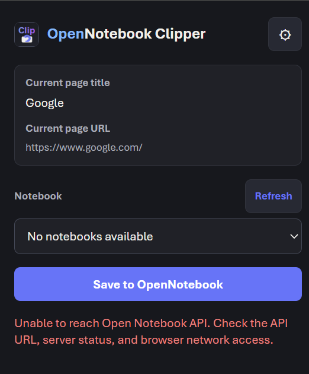
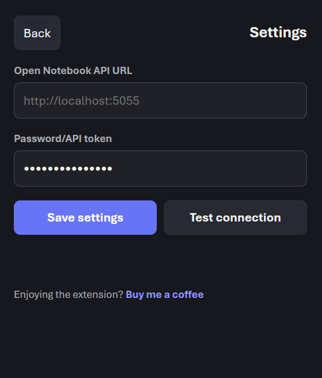

<p align="center">
  
</p>

# OpenNotebook Clipper

OpenNotebook Clipper is a small Chrome Extension MV3 companion for Open Notebook. It saves the current browser tab URL and page title into a selected Open Notebook notebook as a link source.

This MVP saves URLs and page titles. It does not save full article content.

<p align="center">
  
  <br>
  
</p>

## Features

- Save the active tab URL and title to Open Notebook.
- Choose the target notebook from the popup.
- Remember the last selected notebook.
- Right-click any page and choose **Save page to OpenNotebook**.
- Configure your own Open Notebook API URL.
- Store API URL, token/password, and selected notebook in `chrome.storage.local`.
- Use async processing and embedding by default.
- Automatically tries both endpoint styles:
  - `GET /notebooks`
  - `GET /api/notebooks`
  - `POST /sources`
  - `POST /api/sources`
- No analytics.
- No remote scripts.
- No data is sent to the extension developer.

## Install Locally

1. Download or clone this repository.
2. Open Chrome and go to `chrome://extensions`.
3. Turn on **Developer mode**.
4. Click **Load unpacked**.
5. Select the `open-notebook-clipper` folder.
6. Pin the extension from Chrome's extension menu.

## Configure Open Notebook

The extension needs a reachable Open Notebook API URL and an API password/token.

For a local Docker setup, the Open Notebook service should expose the API port and define a unique password. A typical compose service includes:

```yaml
open_notebook:
  image: lfnovo/open_notebook:v1-latest
  ports:
    - "8502:8502"
    - "5055:5055"
  environment:
    - API_URL=http://localhost:5055
    - OPEN_NOTEBOOK_PASSWORD=replace-with-a-unique-password
```

Use your own unique value for `OPEN_NOTEBOOK_PASSWORD`. Do not reuse the SurrealDB password or the encryption key as the extension token.

If your Open Notebook deployment is remote or behind a reverse proxy, set `API_URL` and the extension setting to the browser-accessible API base URL, for example:

```text
https://notebook.example.com
```

or, for a local setup:

```text
http://localhost:5055
```

## Configure The Extension

1. Open the extension popup.
2. Click the gear icon.
3. Enter the Open Notebook API URL.
4. Enter the `OPEN_NOTEBOOK_PASSWORD` value as the password/API token.
5. Click **Save settings**.
6. Allow Chrome access to that API host when prompted.
7. Click **Test connection**.
8. Go back, choose a notebook, and save the current page.

## Right-Click Save

After selecting a notebook once in the popup, you can right-click a page and choose:

```text
Save page to OpenNotebook
```

The context menu uses the last selected notebook. If no notebook has been selected yet, the extension will ask you to open the popup and choose one first.

## Data And Privacy

The extension handles:

- Current tab URL.
- Current tab title.
- Open Notebook API URL.
- Password/API token.
- Last selected notebook ID.

The token is stored locally using `chrome.storage.local`. The extension sends data only to the Open Notebook API URL you configure. It does not include analytics, ads, remote scripts, or tracking.

For Chrome Web Store publishing, see:

- `publishing/PRIVACY_POLICY_DRAFT.md`
- `publishing/PUBLISHING_CHECKLIST.md`
- `publishing/STORE_LISTING_DRAFT.md`

## Troubleshooting

### Unable to reach Open Notebook API

Check that Open Notebook is running and that the API URL is reachable from Chrome. For local Docker installs, start with:

```text
http://localhost:5055
```

### Authentication failed

Use the value configured as `OPEN_NOTEBOOK_PASSWORD`. Do not use:

- `SURREAL_PASSWORD`
- `OPEN_NOTEBOOK_ENCRYPTION_KEY`
- your database password

### No notebooks available

Confirm that Open Notebook has at least one notebook and that the API returns notebooks from `/notebooks` or `/api/notebooks`.

### Reverse proxy path issues

If your deployment exposes Open Notebook under a base path, use that base path as the API URL. Example:

```text
https://example.com/open-notebook
```

### Browser permission prompt

The extension asks Chrome for access only to the configured API host. If you deny the prompt, the extension cannot load notebooks or save pages until access is allowed.

## Project Structure

```text
open-notebook-clipper/
  manifest.json
  popup.html
  popup.css
  popup.js
  background.js
  api.js
  permissions.js
  storage.js
  icons/

publishing/
  PRIVACY_POLICY_DRAFT.md
  PUBLISHING_CHECKLIST.md
  STORE_LISTING_DRAFT.md

assets/
  icon128.png
  screenshots/
```

## Status

This is an MVP intended for fast URL clipping into Open Notebook. Full page extraction, article parsing, and content capture are not included yet.
